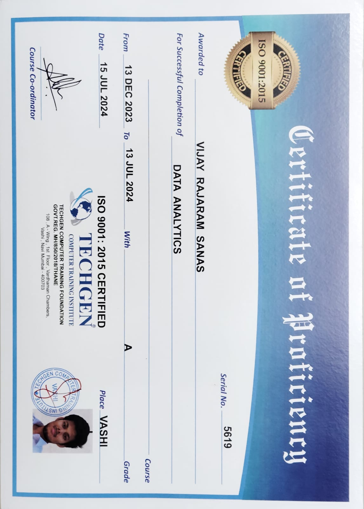

# Data-Analytics-Certification_Techgen-Computer-Training-Institute

This repository showcases my **Data Analytics Certification** awarded by **Techgen Computer Training Institute**, an ISO 9001:2015 certified institution. The certificate demonstrates my proficiency and commitment to mastering Data Analytics concepts and tools.

## Certificate Preview

## Certification Details
- **Certificate Title:** Certificate of Proficiency in Data Analytics
- **Awarded To:** Vijay Rajaram Sanas
- **Institution:** Techgen Computer Training Institute
- **Duration:** 13th December 2023 to 13th July 2024
- **Grade:** A
- **Location:** Vashi, Navi Mumbai

## Key Learnings
The course covered the following areas:
1. **Data Analytics Tools:** Advanced proficiency in Excel, SQL, and Power BI.
2. **Data Transformation & Visualization:** Practical experience in ETL processes and creating impactful dashboards.
3. **Business Insights:** Extracting meaningful patterns and actionable insights from data.
